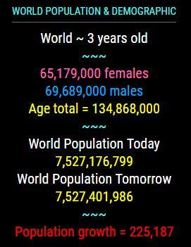
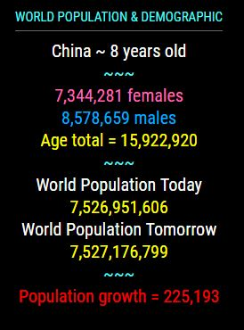
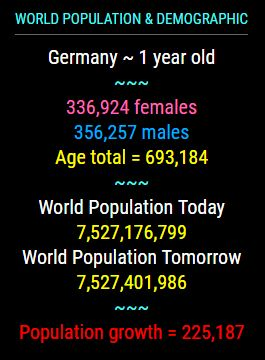

## MMM-Census

* World Population and demographic by age and sex.

## How it works

* Rotation of age groups from less than one year old through 100 years old.
* Male and female populations for each age group and their totals.
* Today's World Population.
* Tomorrow's World Population.
* World Population growth each day.

## OR

* Choose an individual country instead of the world. See county list at bottom.

## Example

* Fully annotated css file so you can fully customize to your liking

, , 

## Installation

* `git clone https://github.com/mykle1/MMM-Census` into the `~/MagicMirror/modules` directory.

* No API key needed! No Dependencies! No kidding!

## Config.js entry and options

    {
        module: 'MMM-Census',
        position: 'top_left',              // Best in left, right or center regions
        config: {
		    country: "World",              // See country list, bottom of README file
            useHeader: true,
			header: "World Population & Demographic",
			maxWidth: "300px",
			animationSpeed: 3000,
			rotateInterval: 1 * 60 * 1000,
        }
    },

## Special thanks and gratitude to SpaceCowboysDude

## Countries to choose from

    "Afghanistan",
    "AFRICA",
    "Albania",
    "Algeria",
    "Angola",
    "Antigua and Barbuda",
    "Arab Rep of Egypt",
    "Argentina",
    "Armenia",
    "Aruba",
    "ASIA",
    "Australia",
    "Australia/New Zealand",
    "Austria",
    "Azerbaijan",
    "The Bahamas",
    "Bahrain",
    "Bangladesh",
    "Barbados",
    "Belarus",
    "Belgium",
    "Belize",
    "Benin",
    "Bhutan",
    "Bolivia",
    "Bosnia and Herzegovina",
    "Botswana",
    "Brazil",
    "Brunei Darussalam",
    "Bulgaria",
    "Burkina Faso",
    "Burundi",
    "Cote-d-Ivoire",
    "Cabo Verde",
    "Cambodia",
    "Cameroon",
    "Canada",
    "Caribbean",
    "Central African Republic",
    "Central America",
    "Central Asia",
    "Chad",
    "Channel Islands",
    "Chile",
    "China",
    "Hong Kong SAR-China",
    "Macao SAR China",
    "Colombia",
    "Comoros",
    "Congo",
    "Costa Rica",
    "Croatia",
    "Cuba",
    "Curacao",
    "Cyprus",
    "Czech Republic",
    "Dem Peoples Rep of Korea",
    "Dem Rep of Congo",
    "Denmark",
    "Djibouti",
    "Dominican Republic",
    "Eastern Africa",
    "Eastern Asia",
    "Eastern Europe",
    "Ecuador",
    "El Salvador",
    "Equatorial Guinea",
    "Eritrea",
    "Estonia",
    "Ethiopia",
    "EUROPE",
    "Federated States of Micronesia",
    "Fiji",
    "Finland",
    "France",
    "French Guiana",
    "French Polynesia",
    "FYR Macedonia",
    "Gabon",
    "The Gambia",
    "Georgia",
    "Germany",
    "Ghana",
    "Greece",
    "Grenada",
    "Guadeloupe",
    "Guam",
    "Guatemala",
    "Guinea",
    "Guinea-Bissau",
    "Guyana",
    "Haiti",
    "Honduras",
    "Hungary",
    "Iceland",
    "India",
    "Indonesia",
    "Islamic Republic of Iran",
    "Iraq",
    "Ireland",
    "Israel",
    "Italy",
    "Jamaica",
    "Japan",
    "Jordan",
    "Kazakhstan",
    "Kenya",
    "Kiribati",
    "Kuwait",
    "Kyrgyz Republic",
    "Lao PDR",
    "LATIN AMERICA AND THE CARIBBEAN",
    "Latvia",
    "Least developed countries",
    "Lebanon",
    "Lesotho",
    "Less developed regions",
    "Less developed regions, excluding China",
    "Less developed regions, excluding least developed countries",
    "Liberia",
    "Libya",
    "Lithuania",
    "Luxembourg",
    "Madagascar",
    "Malawi",
    "Malaysia",
    "Maldives",
    "Mali",
    "Malta",
    "Martinique",
    "Mauritania",
    "Mauritius",
    "Mayotte",
    "Melanesia",
    "Mexico",
    "Micronesia",
    "Middle Africa",
    "Moldova",
    "Mongolia",
    "Montenegro",
    "More developed regions",
    "Morocco",
    "Mozambique",
    "Myanmar",
    "Namibia",
    "Nepal",
    "The Netherlands",
    "New Caledonia",
    "New Zealand",
    "Nicaragua",
    "Niger",
    "Nigeria",
    "Northern Africa",
    "NORTHERN AMERICA",
    "Northern Europe",
    "Norway",
    "OCEANIA",
    "Oman",
    "Other non-specified areas",
    "Pakistan",
    "Panama",
    "Papua New Guinea",
    "Paraguay",
    "Peru",
    "Philippines",
    "Poland",
    "Polynesia",
    "Portugal",
    "Puerto Rico",
    "Qatar",
    "Reunion",
    "RB-de-Venezuela",
    "Rep of Korea",
    "Rep of Yemen",
    "Romania",
    "Russian Federation",
    "Rwanda",
    "St-Lucia",
    "St-Vincent and the Grenadines",
    "Samoa",
    "Sao Tome and Principe",
    "Saudi Arabia",
    "Senegal",
    "Serbia",
    "Seychelles",
    "Sierra Leone",
    "Singapore",
    "Slovak Republic",
    "Slovenia",
    "Solomon Islands",
    "Somalia",
    "South Africa",
    "South America",
    "South Sudan",
    "South-Central Asia",
    "South-Eastern Asia",
    "Southern Africa",
    "Southern Asia",
    "Southern Europe",
    "Spain",
    "Sri Lanka",
    "West Bank and Gaza",
    "Sub-Saharan Africa",
    "Sudan",
    "Suriname",
    "Swaziland",
    "Sweden",
    "Switzerland",
    "Syrian Arab Rep",
    "Tajikistan",
    "Tanzania",
    "Thailand",
    "Timor-Leste",
    "Togo",
    "Tonga",
    "Trinidad and Tobago",
    "Tunisia",
    "Turkey",
    "Turkmenistan",
    "Uganda",
    "Ukraine",
    "United Arab Emirates",
    "United Kingdom",
    "United States",
    "US Virgin Islands",
    "Uruguay",
    "Uzbekistan",
    "Vanuatu",
    "Vietnam",
    "Western Africa",
    "Western Asia",
    "Western Europe",
    "Western Sahara",
    "World",
    "Zambia",
    "Zimbabwe"